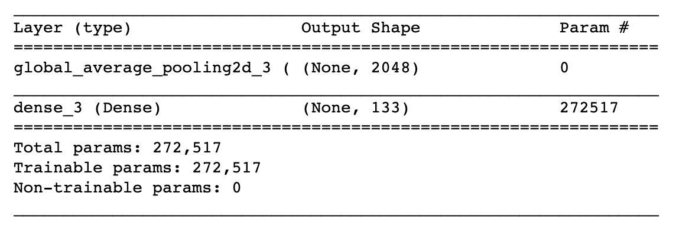
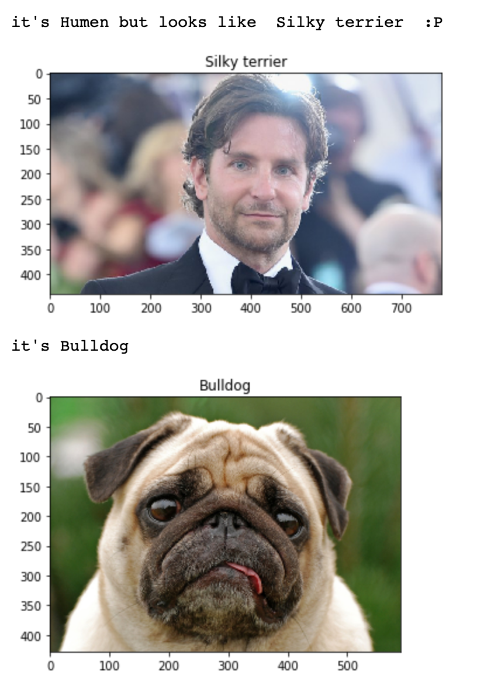
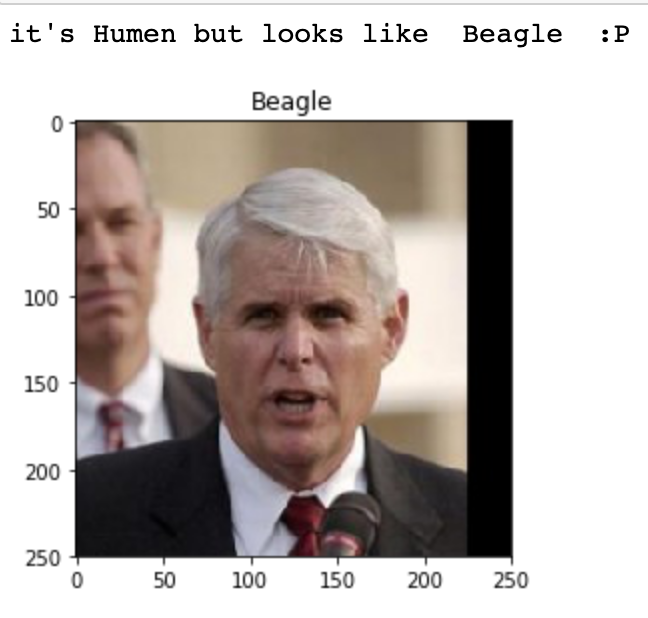

# Dog Breed Project

## Project Overview:
Dog breed project: this project is aimd to detect the human and dogs from images and predict the dog breed and what the closest dog human looks like .

In this real-world setting, you will need to piece together a series of models to perform different tasks; for instance, the algorithm that detects humans in an image will be different from the CNN that infers dog breed. There are many points of possible failure, and no perfect algorithm exists. Your imperfect solution will nonetheless create a fun user experience!

### The Road Ahead

We break the notebook into separate steps. Feel free to use the links below to navigate the notebook.

    Step 0: Import Datasets
    Step 1: Detect Humans
    Step 2: Detect Dogs
    Step 3: Create a CNN to Classify Dog Breeds (from Scratch)
    Step 4: Use a CNN to Classify Dog Breeds (using Transfer Learning)
    Step 5: Create a CNN to Classify Dog Breeds (using Transfer Learning)
    Step 6: Write your Algorithm
    Step 7: Test Your Algorithm

### Required packages:
    
    pip install matplotlib
    pip install matplotlib
    pip install numpy
    pip install pandas 
    pip install keras
    pip install glob
    pip install sklearn

### Datasets:
you can download the Dataset from below links:

[dog_data_set ](https://s3-us-west-1.amazonaws.com/udacity-aind/dog-project/dogImages.zip)

[humen_faces](https://s3-us-west-1.amazonaws.com/udacity-aind/dog-project/lfw.zip)

[DogVGG16Data](https://s3-us-west-1.amazonaws.com/udacity-aind/dog-project/DogVGG16Data.npz)
   
   
   ### Model summery :
   

   
   ### instructions:
   
    git clone https://github.com/Abdullah955/dog_breed.git
    cd dog_breed
    jupyter notebook dog_app.ipynb
   

### Functions:
to detect the humen face:
    
The algorithm will be used to detect the human faces and dogs in an image 

using this function :
    
    detector(img1)
    
    
### Result: 

.
